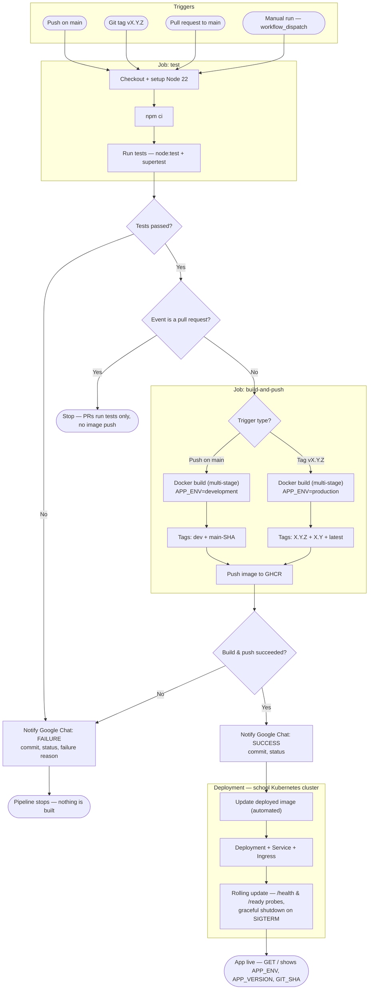

```mermaid
flowchart TD
    subgraph TRIGGERS["Triggers"]
        A1([Push on main])
        A2([Git tag vX.Y.Z])
        A3([Pull request to main])
        A4([Manual run — workflow_dispatch])
    end

    A1 --> T0
    A2 --> T0
    A3 --> T0
    A4 --> T0

    subgraph TEST["Job: test"]
        T0["Checkout + setup Node 22"] --> T1["npm ci"]
        T1 --> T2["Run tests — node:test + supertest"]
    end

    T2 --> D1{"Tests passed?"}
    D1 -- "No" --> N_FAIL["Notify Google Chat: FAILURE<br/>commit, status, failure reason"]
    N_FAIL --> STOP1([Pipeline stops — nothing is built])
    D1 -- "Yes" --> D2{"Event is a pull request?"}
    D2 -- "Yes" --> STOP2([Stop — PRs run tests only, no image push])
    D2 -- "No" --> D3

    subgraph BUILD["Job: build-and-push"]
        D3{"Trigger type?"}
        D3 -- "Push on main" --> B1["Docker build (multi-stage)<br/>APP_ENV=development"]
        D3 -- "Tag vX.Y.Z" --> B2["Docker build (multi-stage)<br/>APP_ENV=production"]
        B1 --> B3["Tags: dev + main-SHA"]
        B2 --> B4["Tags: X.Y.Z + X.Y + latest"]
        B3 --> B5["Push image to GHCR"]
        B4 --> B5
    end

    B5 --> D4{"Build & push succeeded?"}
    D4 -- "No" --> N_FAIL
    D4 -- "Yes" --> N_OK["Notify Google Chat: SUCCESS<br/>commit, status"]

    N_OK --> K0
    subgraph DEPLOY["Deployment — school Kubernetes cluster"]
        K0["Update deployed image (automated)"] --> K1["Deployment + Service + Ingress"]
        K1 --> K2["Rolling update — /health & /ready probes,<br/>graceful shutdown on SIGTERM"]
    end
    K2 --> DONE([App live — GET / shows APP_ENV, APP_VERSION, GIT_SHA])
```

